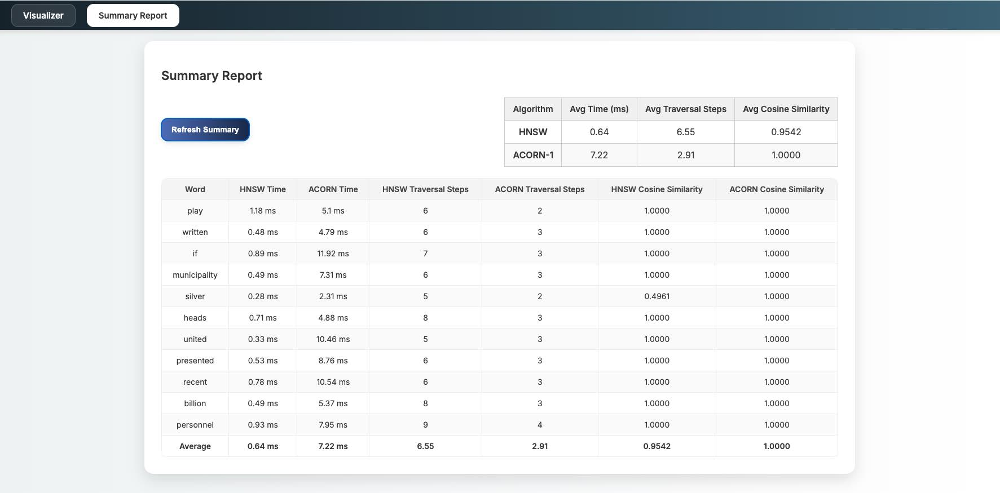

# HNSW vs ACORN-1: Traversal Visualizer

An interactive 3D web application that visualizes and compares search traversals of two approximate nearest neighbor algorithms: Hierarchical Navigable Small World (HNSW) and ACORN-1, using real word embeddings from GloVe.

<p align="center">
   
</p>

The idea of this web application is to help developers analyse their modified algorithms for the results of the search query and if the performance and the results of the search query is better than the original HNSW.

For testing purpose, we have implemented ACORN-1 to analyse its traversal and results with the original HNSW algorithm.

<p align="center">
   
</p>

## Conceptual differenced between HNSW and ACORN-1

| Feature        | HNSW (Hierarchical)                                   | ACORN-1 (Flat Refinement)                              |
|----------------|--------------------------------------------------------|--------------------------------------------------------|
| Structure      | Multi-layer, graph-based index                         | Flat graph with radius-based local refinement          |
| Traversal      | Top-down greedy search (Entry → Middle → Base Layer)  | Starts from same entry point, traverses via radius     |
| Graph Design   | KNN links built in each layer                          | Augments HNSW's base layer with radius neighbors       |
| Efficiency     | Fast and scalable, may miss close neighbors            | Slightly slower per step, improves local accuracy      |
| Use Case       | Large-scale search with logarithmic complexity         | Local refinement where precision matters               |

## Features

1. 3D interactive visualizations using Plotly.js
2. Query search using GloVe dataset (with SBERT - Sentence-transformer fallback if not found)
3. Side-by-side visualization of:
   i. Layered HNSW traversal paths
   ii. ACORN-1 traversal paths
   iii. Radius-based neighbors (togglable)
4. Visualizes:
   i. Query word, entry point, path traces
   ii. HNSW layers: "Entry Layer", "Middle Layer", "Base Layer"
5. Summary report tab:
   i. Shows traversal time, steps, cosine similarity
   ii. Live user searches + 10 random test queries
   iii. Average metrics shown above and below

## Setup Instructions

1. Python Packages:

Create a requirements.txt:

Add these libraries:

flask
flask-cors
numpy
scikit-learn
tqdm
sentence-transformers
plotly

Run this command on the terminal:

```bash
pip install -r requirements.txt
```

Or, you can use conda environment:

```bash
conda create -n hnsw-acorn-env python=3.10
conda activate hnsw-acorn-env
pip install -r requirements.txt
```

## How to run the application:

1. Clone the repository:

```bash
git clone https://github.com/uchiha-saga/Interactive_Query_Visualizer.git
cd Interactive_Query_Visualizer
```

2. Download GloVe embeddings

Place glove.6B.100d.txt in the backend/ directory.
Download from the [official GloVe Website](https://nlp.stanford.edu/projects/glove/)

3. Start the Backend

```bash
cd backend
python app.py
```
Check http://localhost:5050/

## Authors of this repository:
1. Gaurang Kamat
2. Sunho (Sunny) Park


## References 

[1] Y. A. Malkov and D. A. Yashunin, “Efficient and robust approximate
nearest neighbor search using hierarchical navigable small world graphs,”
IEEE Transactions on Pattern Analysis and Machine Intelligence, vol. 42,
no. 4, pp. 824–836, 2018.

[2] J. Pennington, R. Socher, and C. D. Manning, “Glove: Global vectors for
word representation,” in Proceedings of the 2014 conference on empirical
methods in natural language processing (EMNLP), 2014, pp. 1532–1543.

[3] I. T. Jolliffe, “Principal component analysis,” Springer Series in Statistics,
vol. 2, no. 3, pp. 487–488, 2002.

[4] L. Patel, P. Kraft, C. Guestrin, and M. Zaharia, “Acorn: Performant and
predicate-agnostic search over vector embeddings and structured data,”
Proceedings of the ACM on Management of Data, vol. 2, no. 3, pp. 1–
27, 2024.
